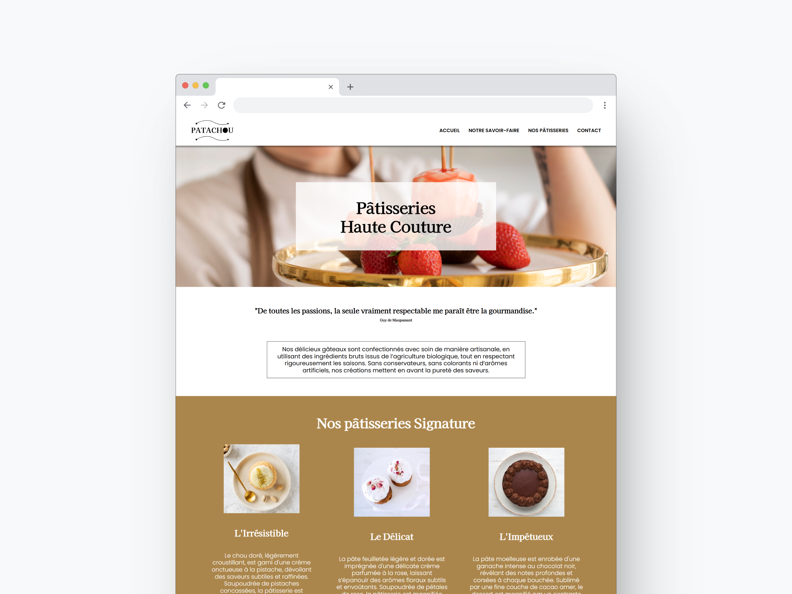

### Consignes

Adapter une page web statique en HTML et CSS d'après une maquette JPG. Commencer le projet en mobile first puis adapter en tablette et desktop avec les media queries. Utilisation de flexbox et de grid.

### Screenshot

### Aperçu en direct

- Lien vers l'aperçu du site : [Aperçu en direct](https://marioncts.github.io/patachou/)
